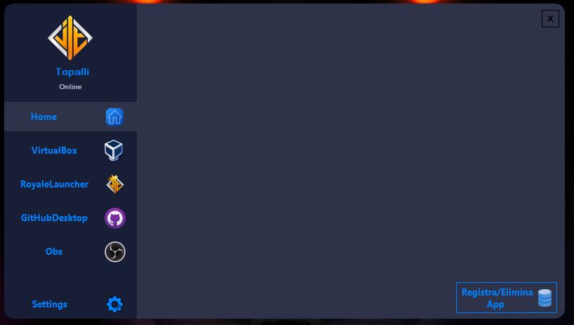

# Royale Launcher

Royale Launcher è un piccolo progetto nato per semplificare l'accesso alle applicazioni preferite degli utenti, raggruppandole in un unico spazio personalizzabile. È ideale per chi desidera un'esperienza di utilizzo più efficiente e personalizzata.

## Caratteristiche principali

- **Organizzazione delle Applicazioni**: Royale Launcher consente agli utenti di raggruppare fino a 12 diverse applicazioni in un unico launcher, facilitando l'avvio delle app preferite senza la necessità di una ricerca ripetuta.

- **Personalizzazione**: Il launcher è completamente personalizzabile secondo i gusti dell'utente. Gli utenti possono scegliere lo sfondo, l'ordine delle applicazioni e altre impostazioni per creare un'interfaccia che si adatti perfettamente alle loro esigenze. 

## Screenshots

### Schermata Principale

*Esempio di schermata principale del Royale Launcher.*

### Impostazioni

*Configurazione delle impostazioni nel Royale Launcher.*

## Installazione

Puoi scaricare l'ultima versione stabile di Royale Launcher dall'apposita sezione delle [Releases](https://github.com/tuonome/RoyaleLauncher/releases).

1. Vai alla pagina delle [Releases](https://github.com/TopalliAlesjo/RoyaleLauncher/releases) su GitHub.
2. Scarica il file di installazione per la versione desiderata (ad esempio `RoyaleLauncher-v1.1.6.0-setup.exe`).
3. Esegui il file di installazione e segui le istruzioni sullo schermo per completare l'installazione.

## Segnalazione dei Bug

Se trovi un bug o riscontri un problema con RoyaleLauncher, ti invitiamo gentilmente ad aprire una nuova issue nel nostro [tracker delle issue](https://github.com/TopalliAlesjo/RoyaleLauncher/issues).

Prima di aprire una nuova issue, per favore controlla che il bug non sia già stato segnalato. Includi tutti i dettagli pertinenti, come il passo per riprodurre il problema e il comportamento atteso.

Grazie per il tuo contributo nel migliorare RoyaleLauncher!

# Nota Bene
Royale Launcher non ha una firma digitale valida, il che potrebbe causare malfunzionamenti a causa degli antivirus che non riconoscono l'applicazione. Pertanto, è necessario esonerare l'app dagli antivirus per garantire il corretto funzionamento. Inoltre, le modifiche come il cambio di icone o logo potrebbero non essere visibili se l'app è bloccata dall'antivirus.